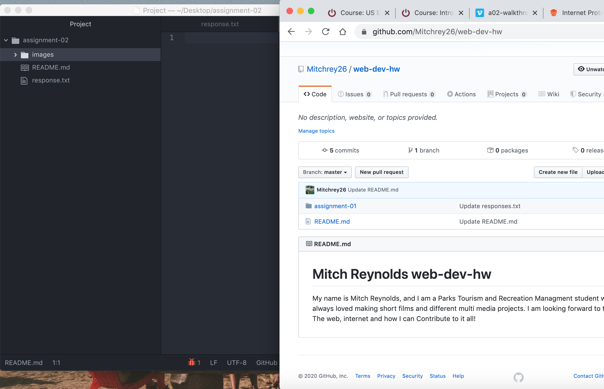

# Assignment-02
## Mitch Reynolds

I decided to take this course because I am interested in how the internet works, and I've always thought that it would be helpful for me to understand how creating a website works. I also needed an  elective credit for my minor Media Arts, and I thought this would be a fun interesting class that would also fulfill the elective credit.

Three things I hope to learn:

- The basic steps of creating a website.
- How the internet physically works
- what the differences are between .com or .org in websites

[Random Website Generator](https://theuselessweb.com/)

[My Response File](./response.txt)

